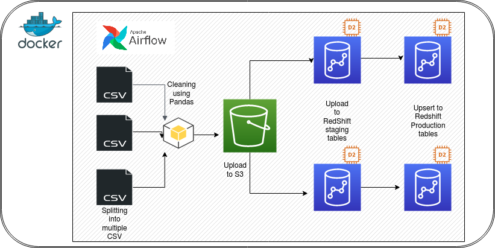
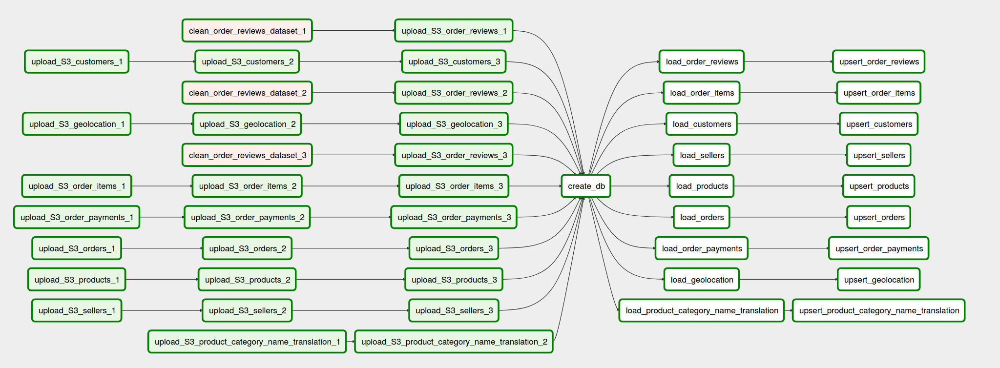
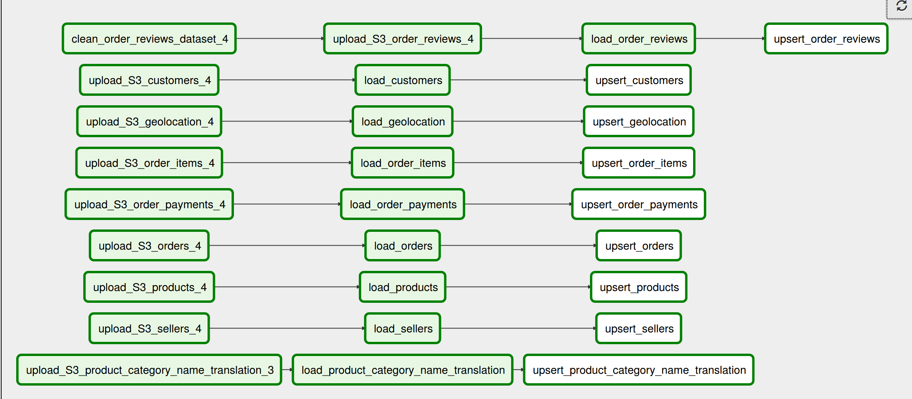

[AWS Redshift based DWH](https://github.com/ramshabukhari/AWS-Redshift-DatawareHouse) is a datawarehouse intended to house a real anonymised commercial dataset. This is a Brazilian E-commerce public dataset of orders made at Olist Store. The dataset has information of 100k orders from 2016 to 2018 made at multiple marketplaces in Brazil. Its features allows viewing an order from multiple dimensions: from order status, price, payment and freight performance to customer location, product attributes and finally reviews written by customers.

## Architecture Diagram

## Architectural Components

- Docker - For building and sharing containerized application
- Airflow - ETL Pipeline Orchestron
- Amazon S3 - Landing Database
- Python Pandas - Data Cleaning Library
- Amazon Redshift - DataWareHouse
- Metabase - Business Intelligence Tool

## Data Schema

The data is divided in multiple datasets for better understanding and organization. Please refer to the following data schema

## ETL Flow

### Special Considerations 

- The CSV files are split into 4 equal sized files to make better use of MPP (Massive parallel processing) paradigm of Amazon Redshift.
AWS recommends splitting the data files so that the number of files is a multiple of the number of slices in your cluster. That way Amazon Redshift can divide the data evenly among the slices. The number of slices per node depends on the node size of the cluster. Since this project uses DC2.large * 2 nodes and every node has 2 slices hence each dataset is divided in four files or roughly equal sizes and separate tasks are written in ETL pipeline to upload each file to S3 so that failure of one task doesn't effect the other.

- Separate reusable plugins are written for common tasks. (i) S3 to Redshift upload using copy command (ii) Redshift Upsert using staging & prods tables

- Two separate DAGS are written. The first DAG shows the full pipeline follow using 3/4 data files. Another separate DAG is written to show how upsert will work if the existing data in Redshift is updated.

### Data Acquistion
- The dataset has been acquired from Kaggle.Particular point of interests were; the data is real hence the analytics can be well trusted.Also, the real life data is expected to offer a challenging cleaning task.Moreover, the dataset had well over 0.1 million records so the loading to production DWH can present practical problems that needed to be addressed. The dataset was multidimensional proving to be a good case study for datawarehousing task.

### Data Splitting and Cleaning
- The data was in a CSV format. In order to make full use of MPP (Massive Parallel Processing) power of RedShift, the data was split into four files if equal size before loading it into S3 landing bucket. For cleaninga nd formatting, Python Library Pandas has been used, in particular making use of vectorization technique to perform operations on 100, 000 rows without iterating over rows individually.

### Uploading to S3
- Amazon RedShift provides two modes to upload the data. One is the Insert method where data can be uploaded to each table separately using the standard SQL Insert command. The other is COPY command where data from multiple files can be loaded from S3 to Redshift in parallel. For this project, COPY command was preferred since MPP being the most impressive feature of Redshift was intended to be used.Hence, the ETL pipeline has task uploading individual CSV files to S3 using S3 hook airflow operator.

### Creation of Database
- Once the upload to S3 is completed, the next task in the dag is triggered, which is creation of table in Redshift DB.The Redshift cluster is already been setup to have two nodes of type dc2.large. The schema is followed from the CSV files and appropriate cnostraints are set to ensure referential integrity, null values and missing data handling. Since Redshift does not provide the insert or update like the standard databases, hence Upsert function had to be performed which requires a staging DB to accomodate the constant uloading of data. Instead of having separate clusters, each table is created twice, one with the staging postfix is used to stage the data before upserting to the production table.
 
### Uploading to RedShift Staging Tables
- The completion of DB creation tasks triggers the loading of all tables in parallel.Airflow pipeline is set to handle --- tasks in parallel so all the staging tables are loaded in parallel using the COPY command. Thanks to MPP feature of Redshift, parallel loading of data from split files requires only ~13secs to upload 0.1 million records into their respective tables.

### Upserting to RedShift Prod Tables
- The completion of staging triggers the upserting of data into the production table.For the first time insertion, since the prods table were empty earlier, its a simple copy of data from the staging to prod table and the task is completed in ~15 secs.

### Separate DAG for Upsert
-To display how the upsert is performed, a separate dag is written which follows the same flow and update the prod tables with new incoming data using the upsert technique. For upserting, the staging and prod tables are joined first, using the primary key as the joining key. The columns that are common in the staging and prod table are deleted, and the new columns are inserted. This deletion rarely occurs practically since the staging tables are always cleared first before uploadig the incoming data. The joinging and deletion is added as a task just to ensure no data is duplicated in the RedShift. This explicitly has to be taken care of since Redshift does not follow the usual primary key logic to ensure unique data.

